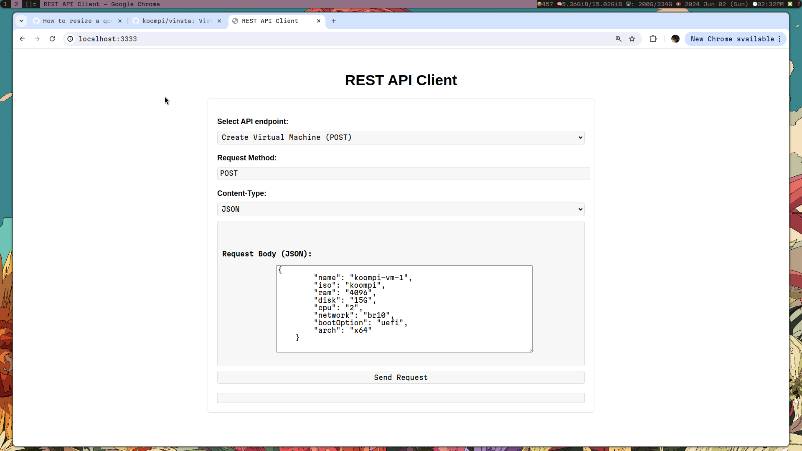

# Vinsta: Virtual Instance Network Solution and Technology Automation

## Introduction

Vinsta empowers you to automate the provisioning, configuration, and management of virtual machine (VM) networks, streamlining your technology infrastructure. With Vinsta, you can:

- Simplify VM network setup with intuitive tools and pre-configured templates.
- Automate repetitive tasks, saving time and reducing human error.
- Manage complex VM network configurations efficiently.
- Improve network reliability and security through automated best practices.

## Key Features

- **VM Network Provisioning:** Create and manage virtual networks for your VMs, eliminating manual configuration steps.
- **Network Automation:** Automate tasks like IP address assignment, subnet creation, firewall rules, and more.
- **Pre-configured Templates:** Leverage pre-built templates to set up common network configurations quickly.
- **Security Automation:** Establish and enforce network security policies for enhanced VM protection.
- **Monitoring and Reporting:** Gain insights into your VM network health and performance.
- **Scalability:** Manage large-scale VM deployments with ease.

## Getting Started

### Prerequisites

- Operating System: (Linux)
- Software: (QEMU,KVM)
- Network: (nat, bridge(br10), host-bridge)

### Installation

### Choose your operating system:
### Installation on KOOMPI OS (Archlinux based)

Please refer to the detailed installation guide for KOOMPI OS:

[Installation Guide for KOOMPI OS](docs/installation-guide/koompi/README.md)

### Installation on Ubuntu

Please refer to the detailed installation guide for Ubuntu:

[Installation Guide for Ubuntu](docs/installation-guide/ubuntu/README.md)

## Basic API Usage

#### Create a Virtual Machine

<details close="close">
<summary><b>POST</b> /api/create</summary>

```json
{
    "name": "koompi-vm-1",
    "iso": "koompi",
    "ram": "4096",
    "disk": "15G",
    "cpu": "2",
    "network": "br10",
    "bootOption": "uefi",
    "arch": "x64"
}
```
</details>

#### Clone a Virtual Machine

<details close="close">
<summary><b>POST</b> /api/clone</summary>

```json
{
  "image": "koompi",
  "name": "koompi-vm1",
  "ram": "8192",
  "disk": "100G",
  "cpu": "8"
}
```
</details>


#### Start a Virtual Machine

<details close="close">
<summary><b>POST</b> /api/start</summary>

```json
{
  "name": "koompi-vm1",
}
```
</details>

#### Stop a Virtual Machine

<details close="close">
<summary><b>POST</b> /api/stop</summary>

```json
{
  "name": "koompi-vm1",
}
```
</details>

#### Remove a Virtual Machine

<details close="close">
<summary><b>POST</b> /api/remove</summary>

```json
{
  "name": "koompi-vm1",
}
```
</details>

#### Check Info of the Virtual Machine

<details close="close">
<summary><b>POST</b> /api/checkinfo</summary>

```json
{
  "name": "koompi-vm1",
}
```
</details>


#### List all of the Virtual Machine

<details close="close">
<summary><b>GET</b> /api/listall</summary>

```json
{
}
```
</details>


## Access Rest API UI Client
#### http://localhost:3333



## Documentation

For detailed documentation, please visit [Vinsta Documentation](https://github.com/koompi/vinsta/docs/README.md).

## Contributing

Contributions are welcome! Please follow these steps to contribute:

1. Fork the repository.
2. Create your feature branch (`git checkout -b feature/AmazingFeature`).
3. Commit your changes (`git commit -m 'Add some AmazingFeature'`).
4. Push to the branch (`git push origin feature/AmazingFeature`).
5. Open a pull request.

## License

Distributed under the MIT License. See `LICENSE` for more information.

## Community

Join the Vinsta community to share your experiences and get support:

- [Forum](https://localhost:3000)
- [Chat](https://localhost:3000)


## Acknowledgments

### WORK IN PROGRESS