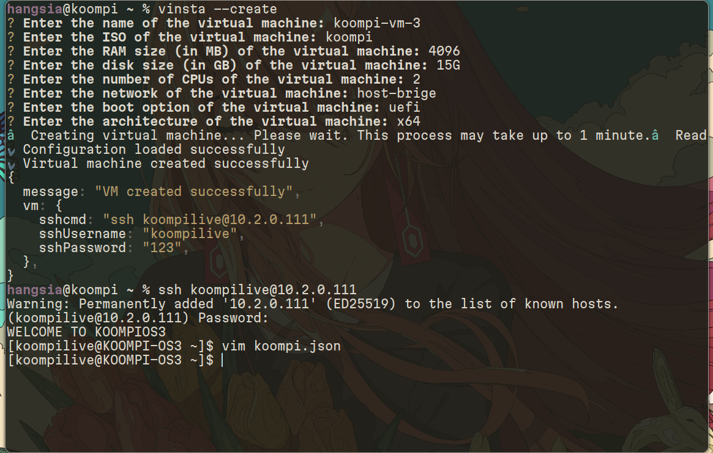

# Vinsta Command line tool

## Installation
Once you have set up the Vinsta server, you can use the Vinsta CLI tool to access all the APIs provided by the Vinsta Server:


```bash
    curl -fsSL https://github.com/koompi/vinsta/raw/main/client/vinsta/script/install_vinsta | bash
```

## <summary><b>vinsta</summary>


## <summary><b>vinsta --init</summary>


<details close="close">
<summary><b>vinsta --create | Create a new Virtual Machine</summary>

### Step 1: run `vinsta --create`


### Step 2: SSH into the VM (Part1)
Using the provided information, edit the installation config if you want to customize the default username and password.




Find and update the following fields to your desired values:

```json
"name": "admin",
"password": "123123123"
```
### Step 3: Start the installation


Once you are ready with the config, simply run the command below to start the installation:

```bash
sudo pibee config koompi.json
```

### Step 4: Reboot the VM


When you see the following message, the installation is complete. Reboot the VM and SSH into it using your new username and password.

```bash
sudo reboot
```

<b>NOTE:</b> You might need to wait a few moments, before you can access the machine because we are using host-bridge here, so the IP address will take sometimes to respond back.

### Step 5: SSH into the VM (Part2)


```bash
ssh admin@10.2.0.111
```

Now you have a virtual machine ready for production use.

</details>

<details close="close">
<summary><b>vinsta --clone  *| Alternative to --create but faster</summary>
</details>


<details close="close">
<summary><b>vinsta --start *| Start a virtual machine</summary>
</details>


<details close="close">
<summary><b>vinsta --stop **| Stop a virtual machine</summary>
</details>


<details close="close">
<summary><b>vinsta --remove | Remove a virtual machine</summary>
</details>

<details close="close">
<summary><b>vinsta --listall| List all of the available virtual machine</summary>
</details>

