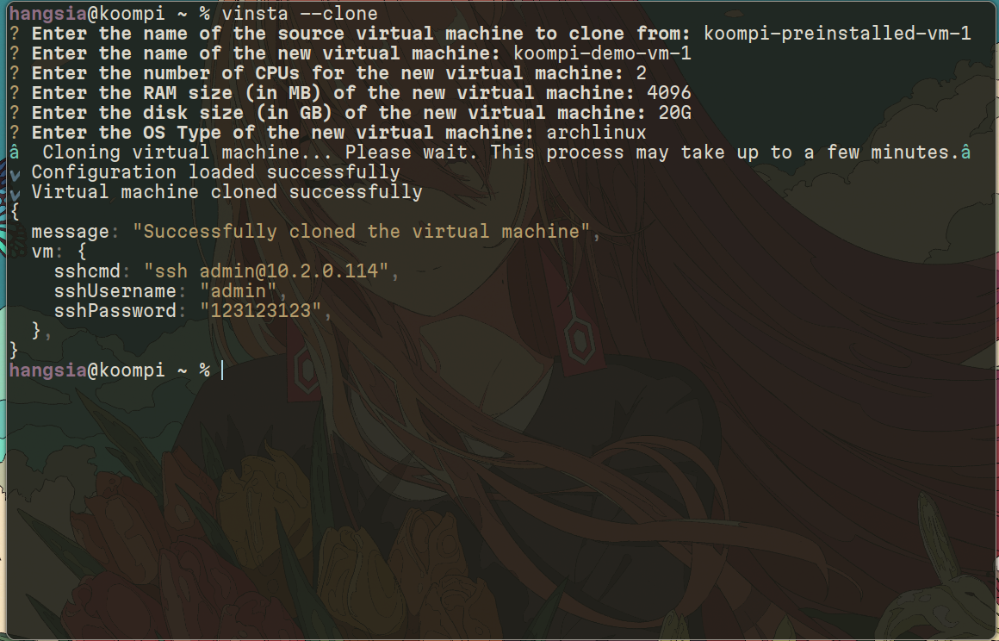
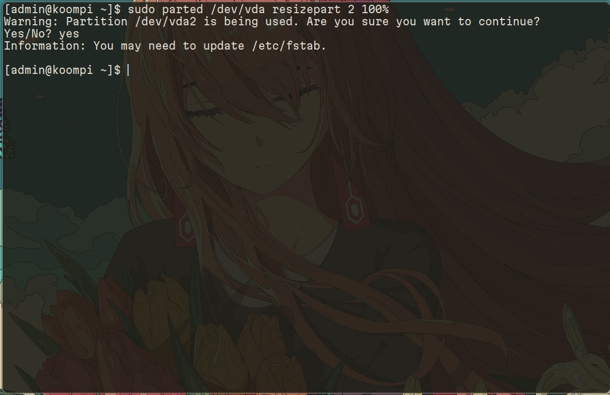
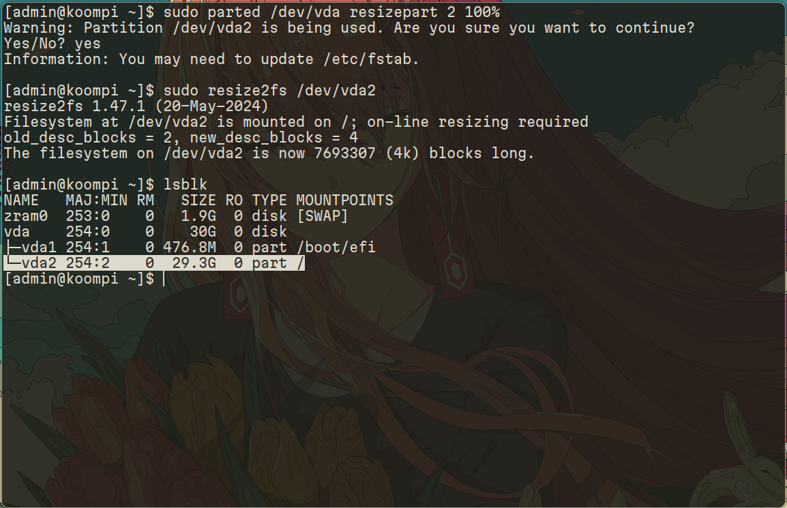

## <summary><b>vinsta --clone | Clone a existing virtual machine</summary>

### Step 1: `vinsta --clone`


<b>NOTE:</b> This doc will assumed that you have followed the document related to setup Vinsta server and done everything right.


If you have done everything right, you can now run `vinsta --clone` without any problem.

```bash
hangsia@koompi ~ % vinsta --clone
? Enter the name of the source virtual machine to clone from: koompi-preinstalled-vm-1
? Enter the name of the new virtual machine: koompi-demo-vm1
? Enter the number of CPUs for the new virtual machine: 2
? Enter the RAM size (in MB) of the new virtual machine: 4096
? Enter the disk size (in GB) of the new virtual machine: 20G
? Enter the OS Type of the new virtual machine: archlinux
Cloning virtual machine... Please wait. This process may take up to a few minutes.
✔ Configuration loaded successfully
✔ Virtual machine cloned successfully
{
  message: "Successfully cloned the virtual machine",
  vm: {
    sshcmd: "ssh admin@10.2.0.114",
    sshUsername: "admin",
    sshPassword: "123123123",
  },
}
```

<b>Remember:</b> Depending on how you name the preinstalled disk image, you might have to change it from `koompi-preinstalled-vm-1` to the correct one.

<details close="close">
<summary><b>Explanation</summary>

### Option 1:
In order to clone a virtual machine from existing virtual machine, you need to have a `*.qcow2` file and store in the `pre-images` folder

```bash
ls pre-images
-rw-r--r-- 1 root           4.8G Jun 10 23:37 koompi-preinstalled-vm-1.qcow2
-rw-r--r-- 1 hangsia 1.3K Jun 10 22:50 README.md
```

If you already setup a virtual machine already and want to reimport it instead of recreating and redo the installation, you can simply copy your running vm from the folder `images/` and put it in `pre-images/` folder.

```bash
ls images
-rw-r--r-- 1 libvirt-qemu   4.8G Jun 12 12:06 koompi-demo-vm-1.qcow2
```

```bash
sudo cp images/koompi-demo-vm-1.qcow2 pre-images/koompi-preinstalled-vm-1.qcow2
```

### Option 2:
Alternatively, we do recommend you to download one of our preinstalled disk image instead from our site.

```bash
cd pre-images/
wget https://dev.koompi.org/iso/qcow/koompi-preinstalled-vm-1.tar.gz
tar -xzvf koompi-preinstalled-vm-1.tar.gz
```
</details>

## Step 2: SSH into VM and expand the partition



### Firstly run:
```bash
sudo parted /dev/vda resizepart 2 100%
```
Example output:
```bash
[admin@koompi ~]$ sudo parted /dev/vda resizepart 2 100%
Warning: Partition /dev/vda2 is being used. Are you sure you want to continue?
Yes/No? yes
Information: You may need to update /etc/fstab.
### This is an example of the output, you will see

```
### Secondly run:
```bash
sudo resize2fs /dev/vda2
```

Example output:

```bash
[admin@koompi ~]$ sudo resize2fs /dev/vda2
resize2fs 1.47.1 (20-May-2024)
Filesystem at /dev/vda2 is mounted on /; on-line resizing required
old_desc_blocks = 2, new_desc_blocks = 4
The filesystem on /dev/vda2 is now 7693307 (4k) blocks long.
### This is an example of the output, you will see

```

### Thirdly run:
Verify whether your hard disk is correct with the one you setup with
```bash
lsblk
```

Example output:
```bash
[admin@koompi ~]$ lsblk
NAME   MAJ:MIN RM   SIZE RO TYPE MOUNTPOINTS
zram0  253:0    0   1.9G  0 disk [SWAP]
vda    254:0    0    30G  0 disk
├─vda1 254:1    0 476.8M  0 part /boot/efi
└─vda2 254:2    0  29.3G  0 part /

```

<b>NOTE:</b> Here you can see it is `30G` Total because the preinstalled disk image came with `10G` and we add `20G` so equal `30G`.

Once you come this far, without any problem, it mean you have successfully clone a virtual machine from the existing one and ready to use.

## Additional Links

- [Back to Previous Section](../README.md)
- [Create Command Documentation](../create/README.md)
- [Start Command Documentation](../start/README.md)
- [Stop Command Documentation](../stop/README.md)
- [Remove Command Documentation](../remove/README.md)
- [Check Command Documentation](../check/README.md)
- [Listall Command Documentation](../listall/README.md)